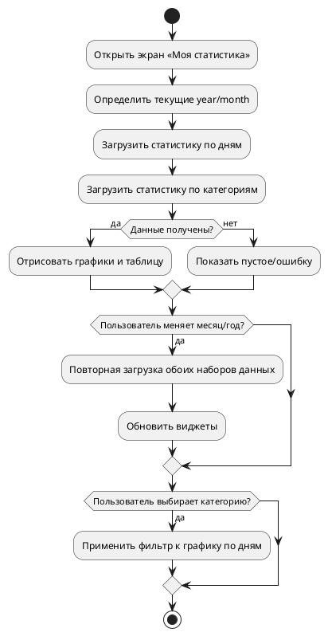

# Техническое задание: Экран «Моя статистика»

## 1. Точки входа

| Способ входа | Описание |
|--------------|----------|
| Из хедера | Кнопка «Моя статистика» → переход на `/statistics` |
| Из экрана календаря | Кнопка/ссылка в хедере календаря → `/statistics` |
| Прямой ввод URL | `/statistics?year=YYYY&month=MM` |

## 2. Суть экрана

Экран показывает траты за выбранный месяц: по дням и по категориям в рамках активного бюджета.

**Функциональность:**
- Переключение месяца и года
- Итог за месяц (Total Spent)
- График по дням
- Диаграмма по категориям
- Таблица категорий (сумма и количество)
- Фильтр по категории (влияет на график и таблицу)

**Планируемые улучшения:**
- Экспорт в CSV/PNG
- Сравнение с прошлым месяцем (разница, %)
- Диапазон произвольных дат

**Навигация:**
- Кнопка назад на календарь `/calendar`
- Ссылка на профиль `/profile`

## 3. Дизайн / Макеты. Состояния

- Базовый вариант дизайна: https://www.figma.com/make/Oltu0IlHNjN3i5VG2fALwJ/Expense-Statistics-Screen-Design\?node-id\=0-4
- Продвинутый вариант: https://www.figma.com/make/woYzNzzrnTrOQUBhG6nJFr/Expense-Statistics-Screen-Design\?node-id\=0-4

| Состояние | Описание                                                                                     |
|----------|----------------------------------------------------------------------------------------------|
| По умолчанию | Загружены текущие `year`, `month`, показаны графики и таблица                                |
| Загрузка | Скелетоны для графиков и таблиц, спиннеры на виджетах                                        |
| Пусто | Если нет расходов за период -- пустое состояние с подсказкой «Нет данных за выбранный месяц» |
| Ошибка | Тост/баннер с сообщением и действием «Повторить»                                             |

### Описание поведения
- При смене периода перезагружаем оба набора данных: по дням и по категориям.
- Клик по категории фильтрует график по дням. Повторный клик снимает фильтр.
- Валюта берётся из активного бюджета; формат суммы -- по локали пользователя.
 - Отображение по макету: двухколоночный вид -- слева категории, справа лента расходов, сверху по центру заголовок месяца и «Всего: X ₽».
 - Сортировка ленты: по дате по убыванию (новые выше). Внутри даты -- расходы в порядке добавления.
 - Формат суммы: разделение тысяч, знак валюты справа, выравнивание суммы по правому краю строки, тире перед суммой как в макете.

## 4. Диаграмма процесса

## 5. API-запросы на экране

| № | Эндпоинт | Метод | Назначение | Параметры |
|---|----------|-------|-----------|-----------|
| 1 | `/api/statistics/expenses-by-day` | `GET` | Статистика расходов по дням | `year`, `month`, `page=1`, `limit=31` |
| 2 | `/api/statistics/category-stats` | `GET` | Статистика по категориям | `year`, `month`, `page=1`, `limit=100` |

Примечания:
- Оба запроса требуют авторизации (JWT).
- Для согласованности UI обе выборки должны относиться к одному и тому же активному бюджету пользователя (бек выбирает актуальный бюджет).

## 6. Блоки экрана

### Хедер
| Элемент | Параметр | Запрос | Условие | Обязательно? | Взаимодействие | Примечание |
|--------|----------|--------|--------|--------------|----------------|------------|
| Переключатель месяца/года | `year`, `month` | — | Всегда | Нет | Изменение → перезагрузка данных | Стрелки или селекты |
| Кнопка «Календарь» | — | — | Всегда | Нет | Переход на `/calendar` | Иконка/текст |
| Заголовок | `Статистика` | — | Всегда | Нет | — | По центру |
| Текущий месяц | `month`, `year` | — | Всегда | Нет | Стрелки влево/вправо | По центру |

### Карточка итогов (Всего)
| Элемент | Параметр | Источник | Условие | Обязательно? |
|--------|----------|----------|---------|--------------|
| Итого за месяц | `sum(totalSpent)` | Агрегация из обоих ответов | Всегда | Да |
| Формат | `24 570 ₽` | Локаль/валюта | Всегда | Да |

### График «Расходы по дням»
| Элемент | Параметр | Источник | Условие | Обязательно? | Примечание |
|--------|----------|----------|---------|--------------|------------|
| Точки по дням | `date`, `totalSpent` | `GET /statistics/expenses-by-day` | Есть данные | Да | Поддержка фильтра по категории |
| Пустое состояние | — | — | Нет данных | Да | Сообщение и CTA «Перейти в календарь» |

### Диаграмма «Категории»
| Элемент | Параметр | Источник | Условие | Обязательно? | Примечание |
|--------|----------|----------|---------|--------------|------------|
| Сегменты/столбцы | `category`, `totalSpent`, `count` | `GET /statistics/category-stats` | Есть данные | Да | Цвета из `Category.color` при возможности |
| Легенда/таблица | те же + `%` | Расчёт по сумме | Всегда | Да | Сортировка по сумме desc |

### Список категорий (левая колонка)
| Элемент | Параметр | Источник | Условие | Обязательно? | Взаимодействие | Примечание |
|--------|----------|----------|---------|--------------|----------------|------------|
| Строка категории | `category`, `totalSpent` | `GET /statistics/category-stats` | Есть данные | Да | Клик → фильтр по категории | Активная строка подсвечена |
| Пусто | — | — | Нет данных | Да | — | Сообщение «Нет данных за месяц» |

### Лента расходов за месяц (правая колонка)
| Элемент | Параметр | Источник | Условие | Обязательно? | Примечание |
|--------|----------|----------|---------|--------------|------------|
| Заголовок даты | `date` | `GET /statistics/expenses-by-day` → `ExpenseByDayViewModel.date` | Есть расходы за дату | Да | Формат «31 августа 2025» |
| Позиция расхода | `title/description`, `category`, `amount` | `ExpenseByDayItem` | Есть данные | Да | Сумма выровнена по правому краю, отображается как «— 570 ₽» |
| Пусто | — | — | Нет расходов за месяц | Да | Единое пустое состояние для правой колонки |

## 7. Взаимодействие с пользователем

| Действие | Возможность |
|--------|-------------|
| Переключение между месяцами | ✅ |
| Фильтр по категории | ✅ |
| Очистка фильтра | ✅ |
| Переход в календарь | ✅ |
| Экспорт CSV/PNG | ⏳ |
| Клик по категории слева фильтрует ленту справа | ✅ |
| Сброс фильтра по повторному клику | ✅ |

## 8. Нефункциональные требования

| Категория | Требование                                           |
|----------|------------------------------------------------------|
| Производительность | Перерисовка графиков ≤ 300 мс после получения данных |
| Доступность | Семантическая верстка, aria-метки, контраст ≥ WCAG AA |
| Локализация | Формат дат/валюты на усмотрение пользователя         |
| Безопасность | Доступ только авторизованным пользователям           |

## 9. События для аналитики

| Событие | Параметры |
|--------|-----------|
| `statistics_opened` | `year`, `month` |
| `statistics_period_changed` | `year`, `month` |
| `statistics_category_filtered` | `category` |
| `statistics_export_clicked` | `format` |

## 10. Обработка ошибок

| Ошибка | Сообщение | Действия |
|--------|----------|----------|
| 401 Unauthorized | «Сессия истекла. Войдите снова.» | Редирект на `/login` |
| 400 Bad Request | «Неверный период. Проверьте месяц/год.» | Подсветка контролов периода |
| 500 Internal Server Error | «Произошла ошибка. Повторите попытку.» | Кнопка «Повторить» |
| Сетевая ошибка | «Нет подключения к интернету» | Offline-баннер, авто-повтор |

## 11. Use cases

| ID | Название | Актор        | Предусловие | Основной поток | Постусловие |
|----|----------|--------------|-------------|----------------|-------------|
| UC-ST-01 | Просмотр статистики за месяц | Пользователь | Авторизован | Открывает экран → загружаются оба набора данных → отображаются графики и таблица | Пользователь видит общую картину расходов |
| UC-ST-02 | Фильтр по категории | Пользователь | Данные загружены | Кликает по категории → график «по дням» фильтруется → повторный клик снимает фильтр | Видит динамику выбранной категории |
| UC-ST-03 | Смена периода | Пользователь | Авторизован | Меняет месяц/год → перезапрос обоих эндпоинтов → UI обновляется | Видит статистику за новый период |

## 12. Юзер-кейсы

| Сценарий | Шаги | Результат |
|----------|------|-----------|
| Просмотр статистики за месяц | 1. Открыть «Моя статистика» 2. Дождаться загрузки данных | Отображаются график по дням, диаграмма по категориям и итог за месяц |
| Фильтр по категории | 1. Клик по категории в легенде/таблице 2. Повторный клик — снять фильтр | График по дням показывает только выбранную категорию / сбрасывается |
| Смена периода | 1. Изменить месяц или год в хедере | Данные перезагружаются, виджеты обновляются на новый период |
| Экспорт (позже) | 1. Нажать «Экспорт CSV/PNG» | Файл формируется и скачивается / недоступно, если нет данных |

