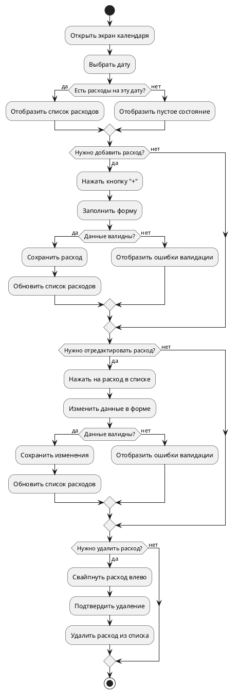
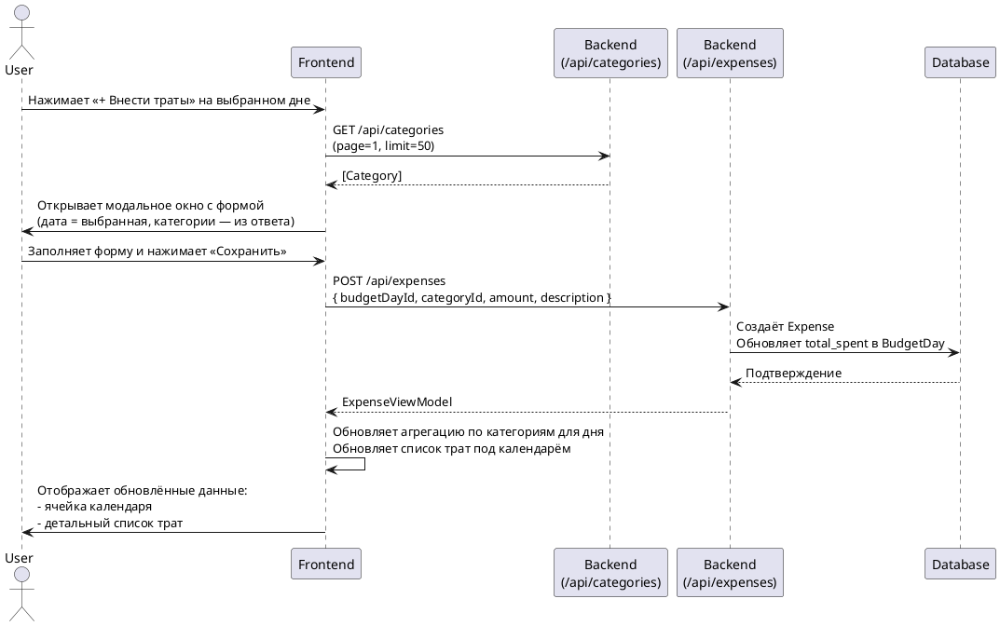
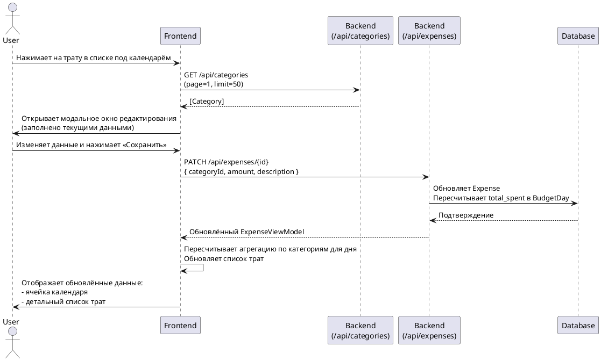
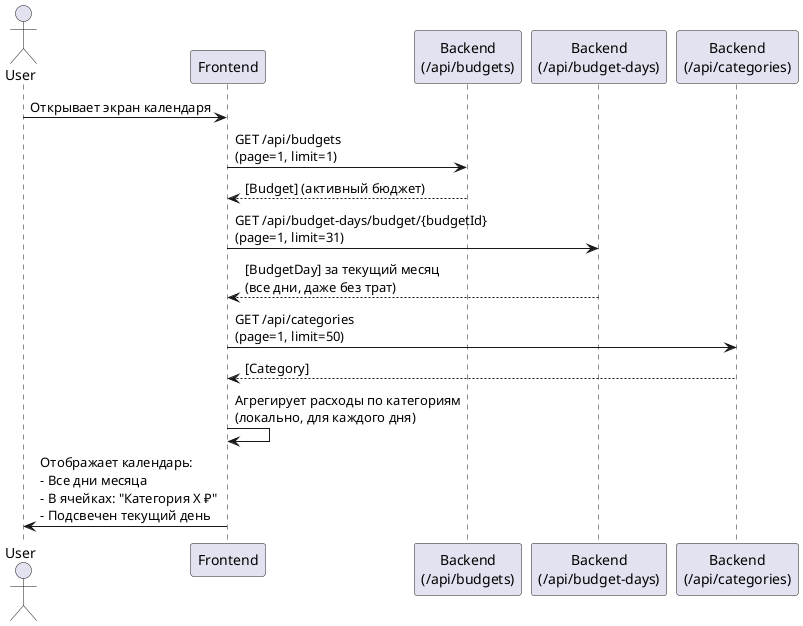

# Техническое задание: Экран календаря

## 1. Точки входа

| Способ входа | Описание |
|--------------|----------|
| После успешной авторизации | Редирект на `/calendar` |
| Через навигацию из хедера | Кнопка «Мой бюджет» → календарь |
| По URL шаринга | ❌ Исключён: шаринг работает только для публичных бюджетов, а календарь — личный экран |

## 2. Суть экрана

Экран календаря предназначен для **внесения и просмотра расходов по дням** в рамках одного активного бюджета.

**Функциональность:**
- Отображение текущего месяца
- Переключение между месяцами
- Выбор дня
- Добавление / редактирование / удаление расходов

**Планируемые улучшения:**
- Дополнительные фильтры
- Сортировка расходов

**Элементы навигации на экране:**
- Иконка профиля в хедере → переход на профиль
- Кнопка перехода на экран статистики
- Кнопка перехода к другим бюджетам (реализуется позже)
- Модальное окно добавления расхода
- Модальное окно редактирования/удаления расхода

## 3. Дизайн / Макеты. Состояния экрана


| Состояние | Описание |
|----------|----------|
| **Календарь** | Выбор дня + обзор трат. Траты агрегированы по категории, не кликабельны (улучшение — позже) |
| **Модальное окно добавления** | Форма для ввода нового расхода |
| **Модальное окно редактирования/удаления** | Форма для изменения или удаления существующего расхода |
| **Источник макетов** | Figma |

### Описание состояний

| Состояние | Поведение |
|----------|----------|
| **По умолчанию** | - Отображается календарь на текущий месяц<br>- Подсвечен текущий день<br>- В ячейках — суммы по категориям (только за прошедшие и текущие дни)<br>- Под календарём — список расходов за текущий день (если есть) |
| **Выбор дня** | - Пользователь кликает на день → под календарём загружается список расходов за этот день<br>- Если день в будущем — кнопка «внести траты» активна, список пуст |
| **Добавление/редактирование расхода** | - Открывается модальное окно<br>- Поля:<br>  • Дата (readonly, подставляется из выбранного дня)<br>  • Категория (выбор из списка)<br>  • Сумма (строка в формате `"1200.00"`)<br>  • Описание (опционально)<br>- Категории по умолчанию: Перевод, Рестораны, Такси, Супермаркеты, Медицина, Развлечения, Образование, Спорт, Одежда и обувь, Красота, Другое<br>- Реальные категории берутся из `GET /api/categories` |
| **Загрузка** | - Индикатор на кнопках и в списке<br>- Блокировка повторных отправок |
| **Ошибка** | - Ошибки валидации — под полями формы<br>- Сетевые ошибки — тост/баннер с возможностью повтора |

## 4. Диаграмма процесса


## 5. API-запросы на экране

| № | Эндпоинт | Метод | Назначение | Параметры |
|---|----------|-------|-----------|-----------|
| 1 | `/api/budgets` | `GET` | Получить список бюджетов пользователя | — |
| 2 | `/api/budget-days/budget/:budgetId` | `GET` | Получить все дни бюджета за месяц | `page=1`, `limit=31` |
| 3 | `/api/categories` | `GET` | Получить категории пользователя | `page=1`, `limit=50` |
| 4 | `/api/expenses/by-day/:dayId` | `GET` | Получить расходы за конкретный день | `page=1`, `limit=100` |
| 5 | `/api/expenses` | `POST` | Создать новый расход | `{ budgetDayId, categoryId, amount, description }` |
| 6 | `/api/expenses/:id` | `PATCH` | Обновить расход | Частичное обновление |
| 7 | `/api/expenses/:id` | `DELETE` | Удалить расход | — |

### Агрегация по категориям для ячейки календаря

**Пример:**  
Вчера внесены траты:  
- «Развлечения 500 ₽», «Развлечения 700 ₽»  
- «Транспорт 300 ₽», «Транспорт 600 ₽»  
- В ячейке видим суммы по категориям:  «Развлечения 1 200 ₽» и «Транспорт 900 ₽» 

**Важно:**  
- ❌ Не использовать `/api/statistics/expenses-by-day` — он не возвращает дни без расходов.  
- ✅ Использовать `/api/budget-days/budget/:budgetId` → агрегировать на фронтенде.

**Алгоритм агрегации (фронтенд):**
```
const aggregated = expenses.reduce((acc, exp) => {
  const key = exp.category.name;
  if (!acc[key]) acc[key] = 0;
  acc[key] += parseFloat(exp.amount);
  return acc;
}, {} as Record<string, number>);
```

## 6. Взаимодействие с пользователем

| Действие | Возможность |
|--------|-------------|
| Переключение между месяцами | ✅ |
| Выбор дня | ✅ |
| Добавление расхода | ✅ |
| Редактирование расхода | ✅ |
| Удаление расхода | ✅ |
| Фильтрация по категориям | ⏳ (позже) |
| Сортировка (по цене, дате, категории) | ⏳ (позже) |

## 7. Нефункциональные требования

| Категория | Требование |
|----------|------------|
| **Производительность** | - Загрузка списка расходов за день ≤ 1 сек<br>- Добавление/редактирование ≤ 0.5 сек |
| **Безопасность** | - Проверка авторизации на сервере<br>- Валидация данных на клиенте и сервере |
| **Доступность** | - Поддержка горячих клавиш<br>- Семантическая верстка для screen readers |

## 8. Бэкенд-реализация (уже готово)

| Компонент | Статус |
|----------|--------|
| Модель `Expense` (`id`, `category`, `title`, `description`, `price`, `date`) | ✅ |
| CRUD-эндпоинты для расходов | ✅ |
| Получение расходов за день | ✅ |
| Валидация при создании/редактировании | ✅ |
| Проверка авторизации по JWT | ✅ |

## 9. Sequence-диаграммы

### Добавление нового расхода



### Редактирование нового расхода




### Получение списка всех расходов для ячеек с днями



## 10. Блоки экрана

### Хедер навигации

| Элемент | Параметр | Запрос | Условие отображения | Обязательно с бэка? | Взаимодействие | Примечание |
|--------|----------|--------|----------------------|---------------------|----------------|------------|
| Кнопка «Мой профиль» | — | — | Всегда | Нет | Переход на `/profile` | Иконка или текст |
| Кнопка «Моя статистика» | — | — | Всегда | Нет | Переход на `/statistics` | Иконка или текст |
| Кнопка «Другие бюджеты» | — | — | Всегда | Нет | Открытие списка бюджетов | Dropdown или отдельный экран |

### Календарь

| Элемент | Параметр | Запрос | Условие | Обязательно? | Взаимодействие | Примечание |
|--------|----------|--------|--------|--------------|----------------|------------|
| Месяц и год | `month`, `year` | — | Всегда | Нет | Переключение стрелками | Над календарём |
| Кнопка «Внести траты» | — | — | Всегда | Нет | Открытие модального окна добавления расхода | Привязана к выбранному дню |
| Ячейка дня | `date` | `GET /api/budget-days/budget/:budgetId` | Всегда | Да | Выбор дня → загрузка списка расходов | Подсвечивается текущий день |

### Ячейка календаря (день)

| Элемент | Параметр | Запрос | Условие отображения | Обязательно? | Взаимодействие | Примечание |
|--------|----------|--------|----------------------|--------------|----------------|------------|
| Строка категории и суммы | `category.name`, `sum(amount)` | Агрегация на фронтенде из `expenses` в `BudgetDayViewModel` | День в прошлом или сегодня, и есть расходы | Нет (агрегируется фронтендом) | Нажатие на ячейку → открытие детального списка | Отображается по одной строке на категорию, например: «Развлечения 1200 ₽» |
| Пустая ячейка | — | — | День в будущем или нет расходов | — | — | Ничего не отображается |

### Список расходов под календарём

| Элемент | Параметр | Запрос | Условие отображения | Обязательно? | Взаимодействие | Примечание |
|--------|----------|--------|---------------------|----------------|-------------------------------|------------|
| Заголовок расхода | `category.name` | `GET /api/expenses/by-day/:dayId` → `ExpenseViewModel.category.name` | Выбран день с расходами | Да | Клик → открытие модального окна редактирования | Может быть иконка категории с цветом |
| Сумма | `amount` | `ExpenseViewModel.amount` | То же | Да | — | Отображается с символом валюты |
| Описание | `description` | `ExpenseViewModel.description` | Если не null | Нет | — | Отображается мелким шрифтом |
| Кнопка «Редактировать» | — | — | Всегда для каждого расхода | Нет | Открытие формы редактирования | Иконка карандаша |
| Кнопка «Удалить» | — | — | Всегда для каждого расхода | Нет | Подтверждение → удаление | Иконка корзины |

### Модальное окно добавления/редактирования расхода

| Элемент | Параметр | Запрос | Условие отображения | Обязательно? | Взаимодействие | Примечание |
|--------|----------|--------|---------------------|----------------|-------------------------------|------------|
| Поле даты | `date` | Выбранная дата в календаре | Всегда | Нет | Только для чтения | Автоматически подставляется |
| Выбор категории | `categories` | `GET /api/categories` → `CategoryViewModel[]` | Всегда | Да | Выбор из выпадающего списка | Отображается цвет категории |
| Сумма | `amount` | — | Всегда | Нет | Ввод числа | Валидация: > 0 |
| Описание | `description` | — | Опционально | Нет | Текстовое поле | Необязательное |
| Кнопка «Сохранить» | — | — | Всегда | Нет | Отправка формы | Доступна только при валидных данных |

## 11. События для аналитики

| Событие | Параметры |
|--------|----------|
| `calendar_date_selected` | `date` (строка в формате ISO 8601) |
| `expense_added` | `category`, `title`, `price`, `date` |
| `expense_updated` | `id`, `category`, `title`, `price` |
| `expense_deleted` | `id` |
| `category_filtered` | `categoryId` |
| `expenses_sorted` | `sortField`, `sortOrder` |

## 12. Обработка ошибок

| Ошибка | Сообщение | Действия |
|--------|----------|----------|
| `401 Unauthorized` | «Сессия истекла. Пожалуйста, войдите снова.» | Редирект на `/login` |
| `404 Not Found` (BudgetDay / Expense) | «Данные не найдены» | Отображение пустого состояния |
| `400 Bad Request` (валидация формы) | «Проверьте правильность заполнения полей» | Подсветка невалидных полей, фокус на первом |
| `500 Internal Server Error` | «Произошла ошибка. Повторите попытку позже.» | Показ тоста с кнопкой «Повторить» |
| Сетевая ошибка | «Нет подключения к интернету» | Показ offline-индикатора, повтор при восстановлении |

## 13. Use cases

| ID | Название | Актор | Предусловие | Основной поток | Постусловие |
|----|--------|-------|-------------|----------------|-------------|
| UC-01 | Просмотр календаря с агрегацией по категориям | Пользователь | Пользователь авторизован, есть активный бюджет | Система загружает дни бюджета за текущий месяц.<br>Для каждого дня система загружает расходы.<br>Система агрегирует расходы по категориям на фронтенде.<br>Отображает календарь с суммами по категориям в ячейках. | Пользователь видит обзор трат за месяц. |
| UC-02 | Добавление нового расхода | Пользователь | Выбран конкретный день в календаре | Пользователь открывает форму добавления.<br>Выбирает категорию из списка (загруженного с бека).<br>Вводит сумму и описание.<br>Сохраняет.<br>Система создаёт расход через POST /api/expenses.<br>Обновляет данные дня и календаря. | Расход создан и отображается в интерфейсе. |
| UC-03 | Редактирование существующего расхода | Пользователь | Расход существует | Пользователь открывает форму редактирования.<br>Меняет категорию/сумму/описание.<br>Сохраняет.<br>Система отправляет PATCH /api/expenses/:id.<br>Обновляет данные в интерфейсе. | Расход обновлён. |
| UC-04 | Удаление расхода | Пользователь | Расход существует | Пользователь нажимает «Удалить».<br>Подтверждает действие.<br>Система отправляет DELETE /api/expenses/:id.<br>Удаляет запись из интерфейса и пересчитывает ячейку календаря. | Расход удалён. |

## 14. Юзер-кейсы

| Сценарий | Шаги | Результат |
|----------|------|-----------|
| **Просмотр расходов за день** | 1. Открыть календарь<br>2. Выбрать дату | Под календарём отображается список расходов за выбранный день |
| **Добавление расхода** | 1. Нажать «+ Внести траты»<br>2. Выбрать категорию, ввести сумму и описание<br>3. Нажать «Сохранить» | Расход появляется в списке под календарём, ячейка календаря обновляется |
| **Редактирование расхода** | 1. Найти расход в списке<br>2. Нажать «Редактировать»<br>3. Изменить данные<br>4. Сохранить | Расход обновляется в списке и в ячейке календаря |
| **Удаление расхода** | 1. Найти расход в списке<br>2. Нажать «Удалить»<br>3. Подтвердить действие | Расход исчезает из списка, ячейка календаря пересчитывается |
